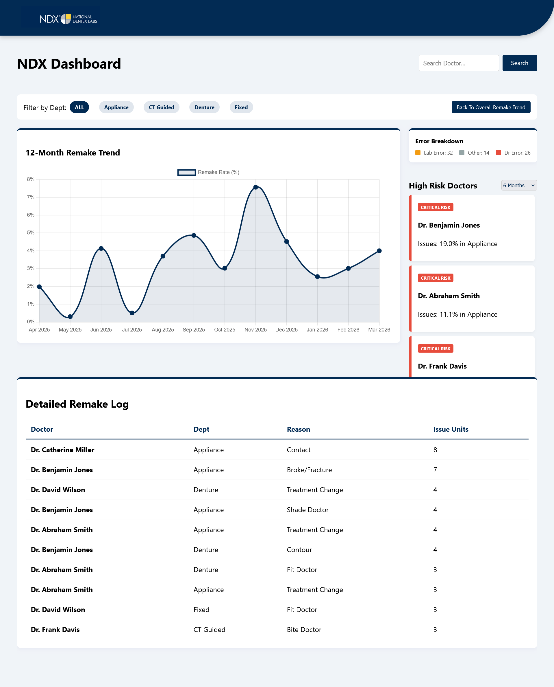

(The data and names used in this Dashboard are not representative of real doctors. The names used here are only for viewing purposes.)

NDX Doctor Dashboard

Internal analytics dashboard used to track dental remake trends and production quality metrics across a 12-month rolling dataset.

Overview

This tool replaces manual Excel review by providing a centralized dashboard for analyzing remake rates across doctors, departments, and production labs.

It processes 200k+ production records imported from structured Excel datasets.

Key Features

- 12-month rolling remake trend analysis
- Doctor and department-level performance tracking
- Risk flagging for high-remake contributors
- Filtering by 3, 6, or 12-month timeframes
- Search-based doctor lookup with live filtering

Data Model

Tracks production-level fields including:
- Case metadata (month, case number, doctor, department)
- Production details (lab, method, scanner, model type)
- Remake classification (doctor vs lab fault)
- Unit-level remake and adjustment counts

Tech Stack

- Django
- Python
- SQLite
- JavaScript

Notes

Designed as an internal operations tool for replacing manual Excel-based reporting workflows.
